# Pupinn AI Service - Technical Documentation

> **AI-Powered Hotel Assistant using Rig Framework**  
> Last Updated: January 20, 2026

## Overview

Pupinn features an intelligent AI assistant powered by the **Rig** framework in Rust. The AI agent can understand natural language booking requests, search for available rooms, and create interactive booking proposals through a conversational interface.

### Key Features

- 🤖 **AI Agent**: Built with Rig framework for LLM-powered conversations
- 🔧 **Custom Tools**: Two specialized tools for room search and booking creation
- 💬 **Natural Language**: Conversational booking through chat interface
- 🎯 **Structured Output**: AI generates structured data for interactive UI
- 🔄 **Real-time**: WebSocket integration for instant responses

---

## Architecture

### AI Service Stack

The following diagram illustrates the complete AI-powered booking system architecture:

```mermaid
flowchart TB
    subgraph Frontend["Frontend Layer"]
        UI["User Chat Interface<br/>(chat-interface.tsx)"]
    end
    
    subgraph Backend["Backend Layer (Rust/Axum)"]
        WS["WebSocket Chat Handler<br/>(api/chat.rs)"]
        
        subgraph AIService["AI Service (services/ai_service.rs)"]
            Agent["Configured AI Agent<br/>(Rig Framework)"]
            
            SearchTool["SearchRoomsTool<br/>• Inputs: check_in, check_out, room_type<br/>• Queries database for availability<br/>• Returns formatted room list"]
            ProposalTool["CreateBookingProposalTool<br/>• Inputs: room_id, check_in, check_out<br/>• Validates dates and room<br/>• Calculates pricing<br/>• Returns BOOKING_PROPOSAL:json"]
        end
    end
    
    subgraph Data["Data Layer"]
        DB[("PostgreSQL Database<br/>• rooms table<br/>• bookings table<br/>• system_settings table")]
    end
    
    UI -->|WebSocket| WS
    WS -->|generate_reply| Agent
    Agent -->|uses| SearchTool
    Agent -->|uses| ProposalTool
    SearchTool -->|queries| DB
    ProposalTool -->|queries| DB
    
    style UI fill:#3b82f6
    style WS fill:#8b5cf6
    style Agent fill:#8b5cf6
    style SearchTool fill:#6366f1
    style ProposalTool fill:#6366f1
    style DB fill:#10b981
```



---

## AI Service Implementation

### File: `backend/src/services/ai_service.rs`

#### Core Components

**1. AiService Struct**
```rust
pub struct AiService {
    pool: DbPool,
}
```
- Holds database connection pool
- Loads AI configuration from database
- Initializes AI agent on each request

**2. Tool Definitions**

##### SearchRoomsTool
```rust
#[derive(Debug, Deserialize, Serialize, schemars::JsonSchema)]
pub struct SearchRoomsInput {
    pub check_in_date: String,    // YYYY-MM-DD format
    pub check_out_date: String,   // YYYY-MM-DD format
    pub room_type: Option<String>, // "single", "double", or "suite"
}
```

**Implementation**:
- Parses dates from string to `NaiveDate`
- Queries `rooms` table for matching type
- Checks availability against existing bookings
- Filters out maintenance/occupied rooms
- Returns formatted list with room details

**Output Format**:
```
Available rooms:
- Room 101: Double room, Price: 1,500,000 VND/night, Room ID: <uuid>
- Room 102: Double room, Price: 1,500,000 VND/night, Room ID: <uuid>
```

##### CreateBookingProposalTool
```rust
#[derive(Debug, Deserialize, Serialize, schemars::JsonSchema)]
pub struct CreateBookingProposalInput {
    pub room_id: String,          // UUID
    pub check_in_date: String,    // YYYY-MM-DD
    pub check_out_date: String,   // YYYY-MM-DD
}
```

**Implementation**:
- Validates room exists and is available
- Parses dates and calculates number of nights
- Calculates total price (nights × room price)
- Generates JSON with all booking details
- Returns as special formatted string

**Output Format**:
```
BOOKING_PROPOSAL:{
  "room_id": "uuid",
  "room_number": "101",
  "room_type": "Double",
  "check_in_date": "2026-02-20",
  "check_out_date": "2026-02-25",
  "nights": 5,
  "price_per_night": 1500000,
  "total_price": 7500000
}
```

**3. System Preamble**

The AI agent is configured with instructions:
```
You are Pupinn, a friendly AI assistant for a hotel management system.
Your role is to help guests book rooms through natural conversation.

Booking Workflow:
1. Greet the user warmly
2. Ask for check-in and check-out dates (must be in YYYY-MM-DD format)
3. Ask about number of guests or room preferences
4. Use search_available_rooms tool to find suitable rooms
5. Present options to the user
6. If user accepts, use create_booking_proposal tool
7. The booking proposal will be shown as an interactive card

Room Type Recommendations:
- 1-2 guests: Single or Double room
- 3-4 guests: Double room
- 5+ guests: Suite

Important:
- Always ask for specific dates in YYYY-MM-DD format
- Use tools to get real-time availability
- Be helpful and conversational
- If user cancels, ask why and suggest alternatives
```

**4. generate_reply() Method**

```rust
pub fn generate_reply(
    &self,
    user_id: Uuid,
    user_name: &str,
    user_message: &str
) -> Option<String>
```

**Flow**:
1. Load AI configuration from `system_settings` table
2. Check if AI is enabled
3. Initialize appropriate LLM client (OpenAI or Gemini based on config)
4. Create Rig agent with system preamble
5. Register both custom tools
6. Create prompt with conversation context
7. Execute agent with prompt (handles tool calls automatically)
8. Return AI response

**Configuration Keys** (in `system_settings`):
- `ai_enabled`: "true" or "false"
- `ai_provider`: "openai" or "gemini"
- `ai_api_key`: API key for the provider
- `ai_model`: Model name (e.g., "gpt-4", "gemini-pro")

---

## Rig Framework Integration

### Dependencies

**Cargo.toml**:
```toml
[dependencies]
rig-core = "0.1"  # Core Rig framework
schemars = "0.8.16"  # JSON Schema for tool definitions
```

### Tool Trait Implementation

Both tools implement the `rig::tool::Tool` trait:

```rust
impl Tool for SearchRoomsTool {
    const NAME: &'static str = "search_available_rooms";
    
    type Error = ToolError;
    type Args = SearchRoomsInput;
    type Output = String;
    
    fn definition(&self, _prompt: String) -> ToolDefinition {
        ToolDefinition {
            name: Self::NAME.to_string(),
            description: "Search for available rooms...".to_string(),
            parameters: schemars::schema_for!(Self::Args),
        }
    }
    
    fn call(&self, args: Self::Args) -> Result<Self::Output, Self::Error> {
        // Implementation
    }
}
```

### Agent Registration

```rust
let agent = client
    .agent("gpt-4")
    .preamble(SYSTEM_PREAMBLE)
    .tool(SearchRoomsTool { pool: self.pool.clone() })
    .tool(CreateBookingProposalTool { pool: self.pool.clone() })
    .build();
```

---

## Frontend Integration

### File: `frontend/components/chat-interface.tsx`

#### Booking Proposal Detection

```typescript
const parseBookingProposal = (content: string) => {
  if (content.includes('BOOKING_PROPOSAL:')) {
    const jsonStr = content.split('BOOKING_PROPOSAL:')[1];
    try {
      return JSON.parse(jsonStr);
    } catch (e) {
      console.error('Failed to parse booking proposal:', e);
      return null;
    }
  }
  return null;
};
```

#### Interactive Booking Card

When `BOOKING_PROPOSAL:` is detected, the frontend:
1. Parses the JSON data
2. Renders a styled booking card with:
   - Room details (number, type)
   - Check-in/check-out dates
   - Number of nights
   - Price breakdown
   - Total price
   - Two action buttons: "Book Now" and "Cancel"

#### Book Now Action

```typescript
const handleBookRoom = async (proposal: BookingProposal) => {
  const response = await fetch('/api/guest/bookings', {
    method: 'POST',
    headers: {
      'Content-Type': 'application/json',
      'Authorization': `Bearer ${token}`
    },
    body: JSON.stringify({
      room_id: proposal.room_id,
      check_in_date: proposal.check_in_date,
      check_out_date: proposal.check_out_date
    })
  });
  
  if (response.ok) {
    // Redirect to bookings page
    router.push('/guest/bookings');
  }
};
```

---

## Complete AI Booking Flow

### Step-by-Step Example

**1. User Initiates**
```
User: "I want to book a room for the Tet Holiday"
```

**2. AI Gathers Information**
```
AI: "I'd be happy to help you book a room for Tet! Could you please 
     provide your check-in and check-out dates in YYYY-MM-DD format?"
```

**3. User Provides Dates**
```
User: "From 2026-02-20 to 2026-02-25"
```

**4. AI Asks for Preferences**
```
AI: "Great! How many guests will be staying?"
```

**5. User Specifies**
```
User: "We have 4 family members"
```

**6. AI Searches (Tool Call)**
```
AI internally calls: search_available_rooms(
  check_in_date: "2026-02-20",
  check_out_date: "2026-02-25",
  room_type: "double"  // AI decides based on 4 guests
)

Tool returns:
"Available rooms:
- Room 101: Double room, Price: 1,500,000 VND/night, Room ID: uuid-101
- Room 201: Double room, Price: 1,600,000 VND/night, Room ID: uuid-201"
```

**7. AI Presents Options**
```
AI: "I found 2 available Double rooms for your dates:
     - Room 101: 1,500,000 VND per night
     - Room 201: 1,600,000 VND per night (premium view)
     
     Which would you prefer?"
```

**8. User Selects**
```
User: "Room 101 sounds good"
```

**9. AI Creates Proposal (Tool Call)**
```
AI internally calls: create_booking_proposal(
  room_id: "uuid-101",
  check_in_date: "2026-02-20",
  check_out_date: "2026-02-25"
)

Tool returns:
"BOOKING_PROPOSAL:{
  "room_id": "uuid-101",
  "room_number": "101",
  "room_type": "Double",
  "check_in_date": "2026-02-20",
  "check_out_date": "2026-02-25",
  "nights": 5,
  "price_per_night": 1500000,
  "total_price": 7500000
}"
```

**10. Frontend Renders Card**

The chat interface detects `BOOKING_PROPOSAL:` and displays an interactive booking card:


**11. User Confirms**
```
User clicks "Book Now"
→ POST /guest/bookings
→ Booking created in database
→ Redirect to My Bookings page
```

---

## Configuration & Setup

### 1. Database Settings

Configure AI settings via Admin panel or direct database insert:

```sql
INSERT INTO system_settings (key, value, description) VALUES
('ai_enabled', 'true', 'Enable AI assistant'),
('ai_provider', 'openai', 'AI provider (openai or gemini)'),
('ai_api_key', 'sk-...', 'API key for AI provider'),
('ai_model', 'gpt-4', 'Model to use (gpt-4, gemini-pro, etc.)');
```

### 2. Supported AI Providers

**OpenAI**:
- Provider: `openai`
- Models: `gpt-4`, `gpt-4-turbo`, `gpt-3.5-turbo`
- Requires: OpenAI API key

**Google Gemini**:
- Provider: `gemini`
- Models: `gemini-pro`, `gemini-1.5-pro`
- Requires: Google AI API key

### 3. Backend Environment

No additional environment variables needed - all configuration is database-driven.

### 4. Bot User Setup

The AI assistant requires a special bot user with UUID `00000000-0000-0000-0000-000000000000`. This is automatically created via database migration:

```sql
-- Migration: 2024-..._create_bot_user/up.sql
INSERT INTO users (id, role, username, email, password_hash, full_name)
VALUES (
    '00000000-0000-0000-0000-000000000000'::uuid,
    'bot',
    'pupinn_bot',
    'bot@pupinn.com',
    '', -- No password for bot
    'Pupinn AI Assistant'
);
```

---

## Testing the AI Service

### 1. Configure AI Settings

Login as admin → Settings → AI Configuration:
- Enable AI: ✓
- Provider: OpenAI
- API Key: Your API key
- Model: gpt-4

### 2. Test Basic Conversation

1. Login as a guest
2. Navigate to Chat
3. Click "Pupinn" contact
4. Send: "Hello"
5. Expected: Friendly greeting from AI

### 3. Test Room Search Flow

**Conversation**:
```
You: "I want to book a room"
AI: "I'd be happy to help! What are your check-in and check-out dates?"
You: "2026-03-15 to 2026-03-20"
AI: "How many guests?"
You: "2 people"
AI: [Searches rooms] "I found these available rooms..."
```

### 4. Test Booking Proposal

**Conversation continues**:
```
You: "Book room 101"
AI: [Creates proposal] 
Frontend: [Renders booking card]
You: [Click "Book Now"]
Result: Booking created, redirected to bookings page
```

### 5. Test Error Handling

**No rooms available**:
```
You: "Book for tomorrow"
AI: [Searches] "Unfortunately, no rooms are available for those dates.
     Would you like to try different dates?"
```

**Invalid dates**:
```
You: "Book for yesterday"
AI: "Please provide check-in and check-out dates in the future in
     YYYY-MM-DD format."
```

---

## Troubleshooting

### AI Not Responding

**Check**:
1. `ai_enabled = 'true'` in `system_settings`
2. Valid API key configured
3. Backend logs for errors: `docker compose logs backend`

### Tool Calls Failing

**Check**:
1. Database connection pool is healthy
2. Rooms exist in database
3. Date format is correct (YYYY-MM-DD)
4. Backend logs for `ToolError` messages

### Booking Proposal Not Rendering

**Check**:
1. Frontend console for parse errors
2. Response contains `BOOKING_PROPOSAL:` prefix
3. JSON is valid after the prefix
4. Chat interface WebSocket is connected

### Rate Limiting

**OpenAI/Gemini rate limits**:
- Implement exponential backoff
- Cache common responses
- Monitor API usage

---

## Performance Considerations

### 1. Async Processing

AI responses are generated asynchronously:
```rust
// In chat.rs WebSocket handler
tokio::spawn(async move {
    let response = ai_service.generate_reply(user_id, name, message);
    // Send response via WebSocket
});
```

This prevents blocking the WebSocket connection during LLM API calls.

### 2. Tool Execution

Tool database queries are synchronous but fast:
- Indexed queries on rooms table
- Efficient availability checks
- Minimal data transfer

### 3. Token Usage

Optimize LLM token usage:
- Concise system preamble
- Focused tool descriptions
- Minimal conversation history

---

## Future Enhancements

### Potential Improvements

1. **Conversation History**: Maintain context across multiple messages
2. **User Preferences**: Remember guest preferences (room type, floor, etc.)
3. **Multi-room Booking**: Support booking multiple rooms in one conversation
4. **Special Requests**: Handle requests like "near elevator", "quiet room"
5. **Pricing Negotiation**: Dynamic pricing based on occupancy
6. **Cancellation Tool**: AI-assisted booking cancellation
7. **Modification Tool**: Change existing booking dates
8. **Recommendation Engine**: Suggest rooms based on past bookings

### Advanced Features

- **Sentiment Analysis**: Detect frustrated users and escalate to human staff
- **Multi-language**: Support Vietnamese, English, and other languages
- **Voice Integration**: Voice-to-text for accessibility
- **Proactive Assistance**: AI initiates contact for check-in reminders

---

## Summary

The Pupinn AI service leverages the Rig framework to provide an intelligent, conversational booking experience:

✅ **Natural Language Understanding**: Users can book rooms conversationally  
✅ **Database Integration**: Real-time availability checks  
✅ **Structured Output**: AI generates UI-ready data  
✅ **Extensible**: Easy to add new tools and capabilities  
✅ **Provider Agnostic**: Supports OpenAI and Gemini  
✅ **Production Ready**: Error handling, async processing, logging  

The AI assistant transforms the traditional booking process into an engaging, user-friendly conversation while maintaining the reliability and accuracy of a database-backed system.
