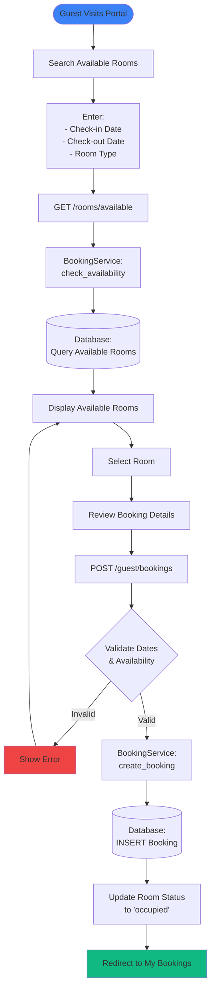
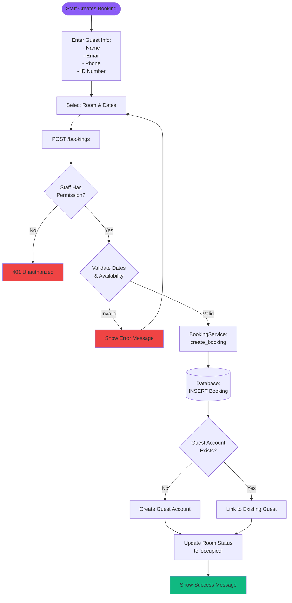
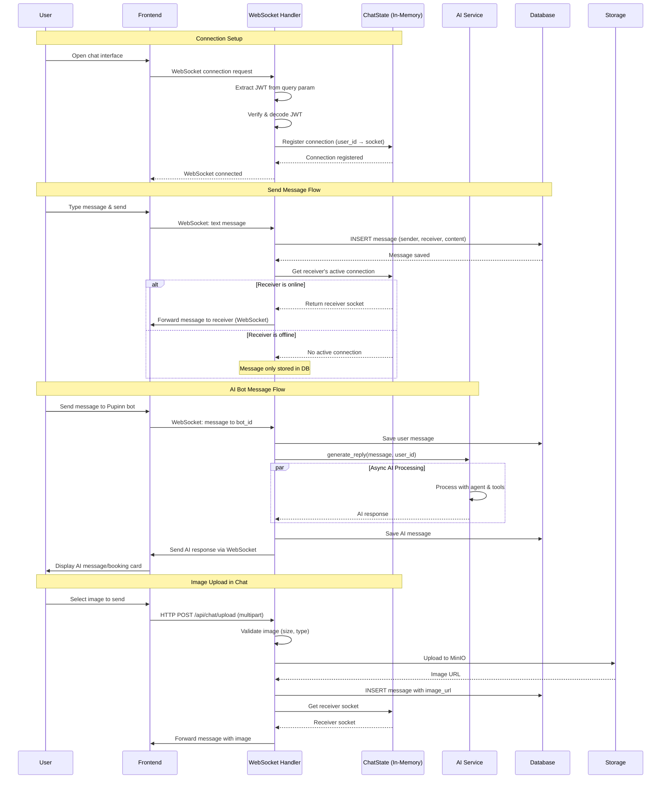
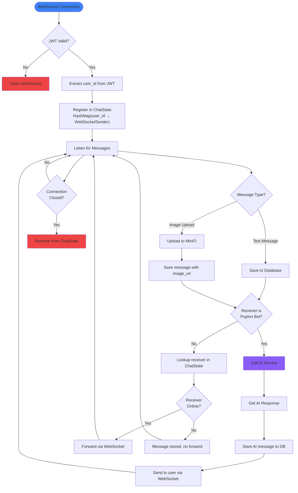
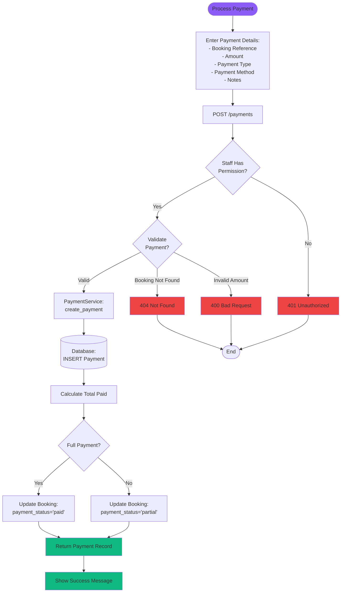

# Pupinn Hotel Management System - Data Flow Documentation

This document provides comprehensive data flow diagrams for the Pupinn hotel management system, illustrating how data moves through the application across different features and components.

## Table of Contents

1. [System Architecture Overview](#system-architecture-overview)
2. [Authentication Flow](#authentication-flow)
3. [Booking Management Flow](#booking-management-flow)
4. [AI-Assisted Booking Flow](#ai-assisted-booking-flow)
5. [Real-time Chat System](#real-time-chat-system)
6. [Room Status Management](#room-status-management)
7. [Payment Processing Flow](#payment-processing-flow)
8. [Image Upload Flow](#image-upload-flow)

---

## System Architecture Overview

The overall system architecture showing the main components and their interactions:

---

## Authentication Flow

### Staff Authentication Flow

### Guest Authentication Flow

---

## Booking Management Flow

### Guest Self-Booking Flow

### Staff Booking Flow

### Check-in/Check-out Flow

---

## AI-Assisted Booking Flow

The AI-powered booking system using the Rig framework with custom tools:

### AI Tool Architecture

---

## Real-time Chat System

### WebSocket Connection & Messaging Flow

### Chat State Management

---

## Room Status Management

### Room Status Lifecycle

### Cleaner Workflow

---

## Payment Processing Flow

### Payment Types & Amounts

---

## Image Upload Flow

### MinIO Integration for Chat Images

### MinIO Configuration Flow

---

## Summary

This document illustrates the complete data flow architecture of the Pupinn hotel management system, covering:

- **Authentication**: Separate flows for staff and guest users with JWT-based security
- **Bookings**: Self-service guest booking and staff-assisted booking workflows
- **AI Integration**: Rig framework-based AI agent with custom tools for intelligent booking assistance
- **Real-time Communication**: WebSocket-based chat with in-memory state management
- **Room Management**: Complete room status lifecycle from available to occupied to cleaned
- **Payments**: Multi-payment support with type validation and booking status updates
- **Image Storage**: MinIO integration for chat image uploads

All components work together to provide a seamless, modern hotel management experience with AI-powered assistance and real-time capabilities.
